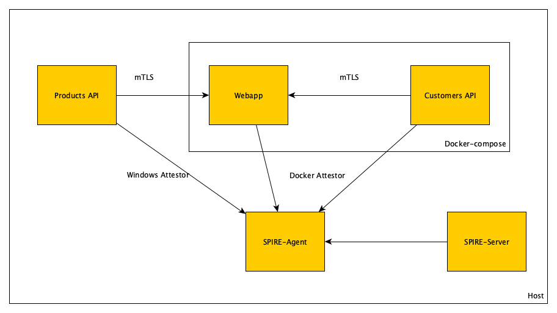

# spire-kubeconeu-2022

## Summary
Demonstrate how to use SPIRE on Windows environments, it was tested using Windows 11 and Windows Server 2022 that shares same kernel, to test in other environments will require to update containers base images. 

This demo consist in 3 applications:
- customers-api: REST api running on a container
- webapp: simple image that calls customers-api and products-api to display content, this app is running in a container
- products-api: REST api running on host



Each app is attesting against SPIRE Agent running on host, using in case Windows workload attestor in case of products-api and Docker workload attestor in case of apps running inside containers.

## Run
In order to start demo run scripts in next order:
```
sh 00-.setup.sh
01-start-server.sh
02-start-agent.sh
sh 03-create-entries.sh
sh 04-start-containers.sh
05-start-products-process.sh
```
In order that agent is able to get information related to docker processes it must be started with privilages
